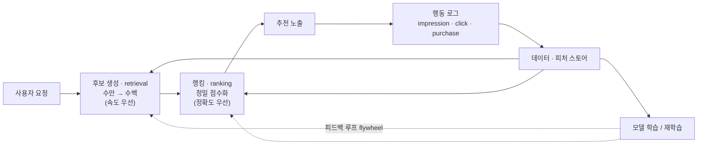
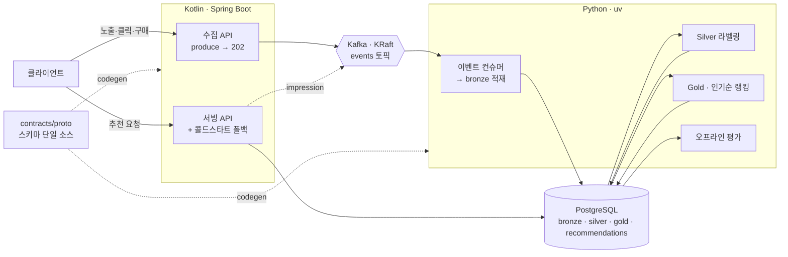
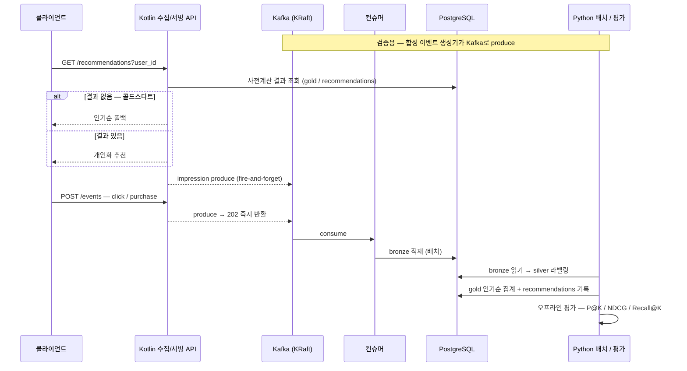
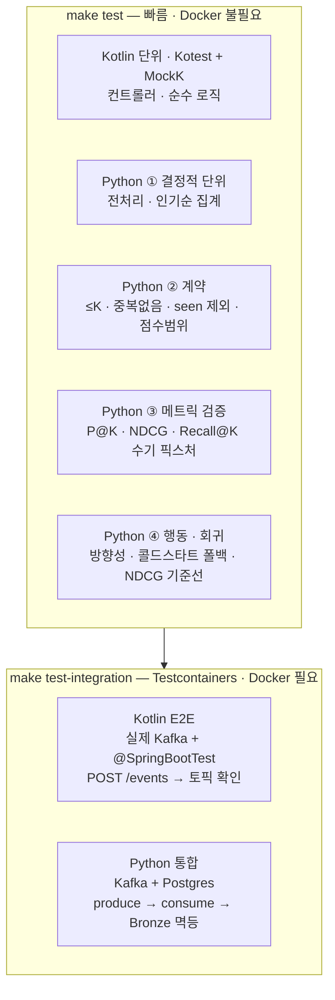

# personalized-reco

퍼스트파티 행동 데이터를 기반으로 한 **개인화 추천 서비스** (이커머스 / 상품 도메인).

단순히 "관련성 높은 항목을 노출"하는 것이 목표가 아니라, **실시간 ML 랭킹으로 비즈니스 성과
(전환·매출)를 최적화**하는 것을 지향한다. 노출 하나하나를 학습해 성과를 지속적으로 개선하는
순환 구조(flywheel)를 핵심으로 본다. *(Moloco 접근 방식 참고)*

> 🚧 **상태**: 초기 스캐폴딩 단계. MVP-1 작업은 GitHub
> [Milestone `MVP-1`](https://github.com/daehoon1112/personalized-reco/milestone/1) ·
> [Epic #1](https://github.com/daehoon1112/personalized-reco/issues/1) 로 추적한다.

---

## 아키텍처: 2단계 파이프라인 + 피드백 루프

후보 생성(retrieval)으로 빠르게 좁히고, 랭킹(ranking)으로 정밀하게 정렬한 뒤, 노출 결과를
다시 학습 데이터로 되먹이는 flywheel 구조다.



- **후보 생성(retrieval)**: 전체 아이템에서 후보를 넓게 추려 수백 개로 축소 (속도 우선).
- **랭킹(ranking)**: 추려진 후보를 정밀하게 점수화해 정렬 (정확도 우선).
- **피드백 루프(flywheel)**: impression / click / purchase 로그 → 데이터·피처 스토어 → 모델 재학습.
  이 순환이 빠르게 도는 것이 곧 경쟁력.

## 시스템 구성 (폴리글랏 · 비동기 수집)

비즈니스/서빙은 **Kotlin(Spring Boot)**, ML·데이터 파이프라인은 **Python(uv)**, 둘은
**Protobuf로 정의한 단일 이벤트 스키마**를 공유한다.

**핫 패스 / 콜드 패스를 분리한다.** 이벤트 수집은 동기 DB 쓰기가 아니라 **Kafka(KRaft)** 로
produce 후 `202` 즉시 반환하고(impression 로깅도 fire-and-forget), 컨슈머가 비동기로 적재한다.
서빙은 사전계산 결과를 읽기만 해 빠르게 응답한다.



## MVP-1 엔드투엔드 흐름

신규 서비스라 실로그가 없으므로, **합성 이벤트 생성기**가 Kafka로 이벤트를 흘려보내
파이프라인 전체를 검증한다. (가장 단순한 인기순 베이스라인으로 flywheel 한 바퀴를 끝까지 돌린다.)



---

## 기술 스택

### 서빙 · 비즈니스 로직 (JVM)
- **Kotlin** — JDK **21 LTS** 툴체인 고정 (로컬은 JDK 25이나 라이브러리 호환성 위해 Gradle toolchain으로 핀)
- **Spring Boot 3.x** — Spring Web, Spring Data JDBC, Validation, Actuator/Micrometer, **Spring for Apache Kafka**
- 빌드: **Gradle (Kotlin DSL)** + Wrapper
- DB 마이그레이션: **Flyway** (DB 스키마 소유자 = JVM 측, Spring Boot가 기동 시 적용)
- 린트/포맷: **ktlint** + **detekt**

### 메시징 (비동기 수집)
- **Apache Kafka (KRaft 모드, ZooKeeper 없음)** — docker-compose 단일 브로커로 시작
- 수집 API = 프로듀서(produce 후 202), 별도 **컨슈머**가 Bronze로 적재 (핫 패스 분리)

### ML · 데이터 파이프라인 (Python)
- **Python 3.12**, 패키지·워크스페이스 관리 **uv**
- 핵심 라이브러리: **pandas · numpy · scikit-learn**(평가 지표), **psycopg**(Postgres)
- 모델: MVP=**인기순 베이스라인** → 이후 **implicit / LightFM**(협업 필터링) → 하이브리드 → 딥러닝
- 린트/타입: **ruff** + **mypy**
- 오케스트레이션: MVP는 CLI/Makefile, 추후 Prefect/Dagster 검토 *(현재 범위 외)*

### 데이터
- **PostgreSQL 16** 단일 저장소 — **Bronze / Silver / Gold** 레이어 + 서빙용 결과를 모두 Postgres로 운영
  (소규모 초기 단순화. 규모 커지면 오브젝트 스토리지/웨어하우스로 분리)
- 로컬 실행: **Docker Compose** (Postgres + Kafka). Redis(서빙 캐시)는 추후
- 이벤트 스키마 단일 소스: **Protobuf + buf** → Kotlin·Python 타입 코드젠 (HTTP/Kafka payload는 proto-over-JSON)

### 저장소 · 공통
- 구조: **폴리글랏 모노레포** — Gradle(Kotlin) + uv(Python), 루트 **Makefile**로 통합 태스크
- CI: **GitHub Actions** (gradle build/test · uv sync/test · buf lint)
- 컨벤션: Conventional Commits · 짧은 feature 브랜치(trunk-based)

## 모노레포 구조 (계획)

```text
personalized-reco/
├─ apps/
│  ├─ serving/          # Kotlin · Spring Boot — 수집 API(producer) + 추천 서빙 (+ Flyway)
│  └─ pipelines/        # Python — Kafka 컨슈머(bronze 적재) · silver 라벨링 · gold/인기순 · 평가 · 합성 이벤트
├─ packages/
│  ├─ schema-py/        # protobuf → Python 타입 코드젠 산출물
│  └─ py-common/        # Python 공유 (DB 액세스 · 설정 · 지표 유틸)
├─ contracts/proto/     # ★ 이벤트/아이템/유저 스키마 단일 소스 + buf.yaml
├─ infra/
│  └─ docker-compose.yml  # PostgreSQL + Kafka(KRaft)
├─ data/                # 로컬 산출물 (git ignore)
├─ docs/
├─ Makefile             # 통합 태스크: build · test · up · migrate · codegen · seed · consume · label · batch · eval
├─ build.gradle.kts · settings.gradle.kts · gradlew   # Gradle (Kotlin), schema-kotlin 코드젠 포함
├─ pyproject.toml       # uv workspace 루트
└─ CLAUDE.md · README.md · LICENSE
```

> Kotlin용 proto 타입은 Gradle 빌드 단계에서 생성되어 `apps/serving`이 소비한다.

## 테스트

모듈 성격에 맞춰 테스트를 나눈다(테스트 피라미드 — 빠른 것 많이, 느린 것 적게). 전체 정책은
[docs/testing.md](./docs/testing.md). **빠른 테스트는 Docker 없이**, **통합/E2E는 Testcontainers**로 돈다.



### 어떻게 짜나

- **서빙 (Kotlin)** — `apps/serving/src/test/...`, **Kotest** 스펙(`StringSpec`).
  - 단위: 협력자(`KafkaTemplate` 등)는 **MockK**로 모킹, I/O 없이 빠르게.
  - E2E: `@SpringBootTest` + **Testcontainers**(실제 Kafka). `@Tags("Integration")`으로 표시 → 기본 `test`에서 제외.
- **모델 / 데이터 (Python)** — `apps/pipelines/tests`, `packages/py-common/tests`, **pytest**.
  - ① 결정적 단위 ② 계약(형식 불변식) ③ 메트릭 수기 검증 ④ 행동·회귀.
  - Testcontainers 통합은 `@pytest.mark.integration`으로 표시 → 기본 실행에서 제외.
- **원칙**: 단위 계층은 고정 시드·고정 픽스처(벽시계·네트워크 금지). 메트릭은 손으로 답을 아는
  값으로 못 박는다(지표가 틀리면 평가 전체가 거짓말).

### 실행

```bash
make test              # 단위 · 계약 · 메트릭 · 행동 (빠름, Docker 불필요)
make test-integration  # E2E · 통합 (Testcontainers, Docker 필요)
```

---

## 데이터 전략 (가장 중요한 기반)

- **이벤트 로깅 스키마**(impression / click / cart / purchase)는 초기에 확정한다. 나중에 바꾸기 매우 어렵다.
  → Protobuf 단일 소스로 Kotlin·Python이 동일 계약을 공유한다. 엔벨로프에 `consent`(동의)와
  `position`(노출 순위)을 포함한다.
- **수집은 비동기**: 요청 경로에서 DB를 직접 쓰지 않고 Kafka로 흘려보낸다(고볼륨 impression 대비).
- 아이템 메타데이터 · 유저 프로필 관리.
- **콜드 스타트**: 신규 유저/아이템은 인기순·콘텐츠 기반 폴백으로 대응.
- **피처 스토어**: 행동·아이템·컨텍스트 피처를 retrieval/ranking 단계에 공급.

## 데이터 레이어링 & 학습 데이터

원천 이벤트(atomic)는 그대로는 학습에 못 쓴다. **전부 Postgres** 안에서 레이어로 가공해 모델에 먹인다.

| 레이어 | 내용 | 예시 테이블 |
|---|---|---|
| **Bronze** | 받은 그대로의 불변 이벤트 (append-only) | `events_raw` |
| **Silver** | 세션화·중복제거 + impression↔결과 조인 **라벨링** | `labeled_impressions` |
| **Gold** | 모델별 학습 입력 | `item_popularity`, `user_item_interactions` |

모델 단계별 입력 구조:

- **인기순 (MVP)**: `(item_id, window, click_cnt, purchase_cnt, score)` 집계.
- **협업필터링(CF)**: 암묵 피드백 `(user_id, item_id, weight)` → 희소 행렬 (implicit / LightFM).
- **랭킹 / 딥러닝**: impression 단위 라벨 예제
  `(ts, user_id, item_id, position, context, user_features, item_features, label, served_model_version)`.

설계 시 반드시 지킬 것:

- **Point-in-time correctness (누수 방지)**: 피처는 "지금"이 아니라 **impression 시점 상태** 기준.
- **Attribution window**: 라벨 귀속 윈도 정의 — 예: 클릭=세션 내, 구매=24h 내.
- **Position bias**: 위에 노출될수록 더 클릭됨 → `position`을 로깅해 두고 추후 보정(IPS 등)에 사용.

## 모델링 (MVP-first, 단계적 고도화)

1. 규칙 기반 + 인기순
2. 협업 필터링 (유저/아이템 유사도)
3. 콘텐츠 기반 / 하이브리드
4. 딥러닝 (데이터·트래픽이 쌓인 후)

> 처음부터 딥러닝·실시간을 전부 넣지 않는다. 단순하게 시작해 검증 후 고도화한다.

## 평가 & 피드백

- **오프라인 지표**: Precision@K, NDCG, Recall@K 로 모델 사전 검증.
- **온라인 검증**: A/B 테스트로 클릭률·전환율 등 비즈니스 지표 확인 (필수).
- 북극성 지표(잠정): **전환율(CVR)**, 가드레일 **GMV**.

## MVP 로드맵 (빌드 순서)

1. **이벤트 로깅 + 평가 파이프라인 구축·검증**  ← 현재 단계 ([Milestone MVP-1](https://github.com/daehoon1112/personalized-reco/milestone/1))
2. 협업 필터링으로 개인화 적용
3. A/B 테스트로 효과 확인
4. 데이터 축적 후 딥러닝으로 고도화

## 개인정보 · 보안

- 데이터는 저장·전송 시 암호화.
- 개인정보보호법(PIPA) 준수, 앱이면 추적 동의(ATT) 설계를 초기부터 반영.
- 이벤트에 동의(consent) 플래그를 스키마 레벨에서 포함.

## License

[MIT](./LICENSE)
