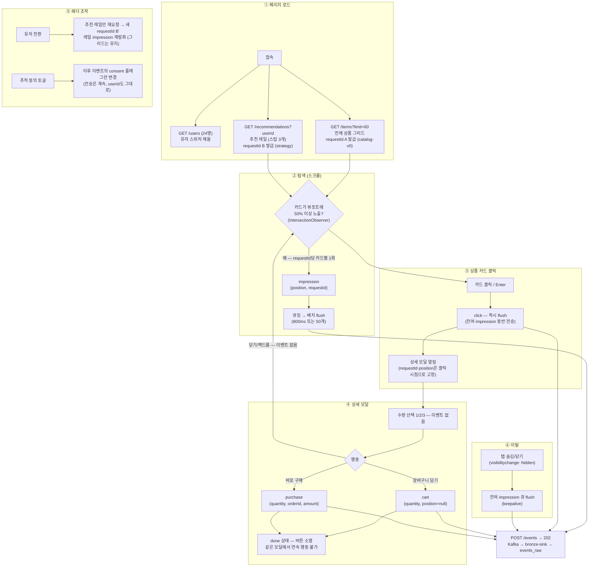

# UI 행동 × 이벤트 플로우 (apps/web 데모 스토어)

데모 스토어프론트의 화면 구조와, 고객 행동 패턴에 따라 어떤 이벤트(impression / click / cart /
purchase)가 언제·어떻게 `POST /events`로 나가는지 정리한다.

> 근거 코드 (2026-07-05 기준): `apps/web/src/App.tsx` · `tracker.ts` · `useImpression.ts` ·
> `components/ProductCard.tsx` · `components/ProductModal.tsx`,
> 서빙 스텁 `apps/serving/src/main/kotlin/me/imweb/reco/serving/api/ExampleRecommendationController.kt`.
> 이벤트·라벨링 계약의 원 정의는 [data-model.md](./data-model.md) 참조.

## 1. 화면 구성

화면은 **홈 단일 페이지 + 상품 상세 모달**이 전부다. 이벤트가 태어나는 지점은 아래 두 곳뿐이다.

```
┌────────────────────────────────────────────────────────────┐
│ reco 데모 스토어        유저 [u-000123 ▾]  ☑ 추적 동의  📨 27│ ← 이벤트 없음
├────────────────────────────────────────────────────────────┤
│ u-000123님을 위한 추천 · popularity-fallback (example)      │
│ ┌─────┐ ┌─────┐ ┌─────┐                    requestId B     │
│ │ #1  │ │ #2  │ │ #3  │  ← impression      (modelVersion    │
│ └─────┘ └─────┘ └─────┘     + click          =strategy)     │
│                                                            │
│ 전체 상품 (60개)                                            │
│ ┌─────┐ ┌─────┐ ┌─────┐ ┌─────┐            requestId A     │
│ │ #1  │ │ #2  │ │ #3  │ │ #4  │ ← impression (modelVersion  │
│ └─────┘ └─────┘ └─────┘ └─────┘    + click    =catalog-v0)  │
│ ─ ─ ─ ─ ─ 뷰포트 경계: 스크롤 전에는 impression 없음 ─ ─ ─ ─ │
│ ┌─────┐ ┌─────┐ …  #60까지                                  │
└────────────────────────────────────────────────────────────┘

┌───────── 상품 상세 모달 ─────────┐   열린 시점에 click은 이미 기록된 상태
│ 무선 이어버드              [×]  │ ← 닫기/백드롭: 이벤트 없음
│ 사운드코어 · digital · i-0003   │
│ 89,000원                        │
│ 수량 [1] [2] [3]                │ ← 이벤트 없음
│ [장바구니 담기]   [바로 구매]    │ ← cart / purchase (즉시 전송)
└─────────────────────────────────┘
```

- **requestId = 노출 배치 키**: fetch 1회(그리드 로드, 추천 응답)마다 하나 발급.
  같은 노출에서 이어진 impression↔click/cart/purchase가 공유한다 → silver 라벨링의 조인 키.
- 추천 레일은 아직 **스텁**(고정 3개, `item-1~3`)이다. 카탈로그에 없는 아이템이라 UI에는
  "노브랜드 / 가격 미정"으로 렌더되고, 가격 null → 모달에서 구매 버튼 비활성.

## 2. 행동 → 이벤트 플로우



## 3. 이벤트 계약 요약

| 이벤트 | 트리거 | 전송 방식 | position | 추가 context 필드 |
|---|---|---|---|---|
| `impression` | 카드가 뷰포트에 50% 이상 노출 (requestId당 카드별 1회) | 큐잉 → 800ms 또는 50개 배치 | ○ | — |
| `click` | 카드 클릭/Enter (모달 열림과 동시) | 즉시 flush (잔여 impression 동반) | ○ | — |
| `cart` | 모달 "장바구니 담기" | 즉시 | `null` | `quantity` |
| `purchase` | 모달 "바로 구매" | 즉시 | `null` | `quantity`, `orderId`(자동 생성), `unitPrice`, `amount`, `currency` |

공통 엔벨로프: `eventId` · `eventType` · `userId` · `itemId` · `sessionId` · `position` · `consent` ·
`ts` · `context{device, page, requestId, modelVersion}`.

- position은 impression/click에만 싣는다 — position bias 보정(IPS 등) 전제와 일치.
- click/cart/purchase는 유실 비용이 커서 즉시 전송, 고볼륨 impression만 배치.

## 4. 전송 파이프라인 (핫 패스)

```
Tracker(브라우저) ──POST /events──▶ serving(202 즉시 반환) ──produce──▶ Kafka ──▶ bronze-sink ──▶ events_raw
  imp: 큐잉/배치                      fire-and-forget                                              (append-only)
  clk·cart·pur: 즉시                                                                                    │
                                                              silver 라벨링(requestId 조인) ◀──────────┘
```

## 5. 세션당 이벤트 볼륨 추정

데스크톱 뷰포트에서 첫 화면에 레일 3 + 그리드 약 8개 카드가 보인다고 가정.

| 행동 패턴 | 이벤트 수 | 구성 |
|---|---|---|
| 튕김 (첫 화면만 보고 이탈) | ~11 | imp 11 (배치 1회) |
| 탐색 (끝까지 스크롤) | ~63 | imp 63 (스크롤 속도 따라 flush 2~5회) |
| 구매 세션 (탐색 + 클릭 2회 + cart + 구매) | ~67 | imp 63 · clk 2 · cart 1 · pur 1 |
| 유저 전환 1회당 추가분 | +3 | 레일만 새 requestId로 재노출 |

- 트래픽의 대부분은 impression (구매 세션 기준 imp : 전환 이벤트 ≈ 16 : 1) — 수집을 비동기로 설계한 이유.
- 레일이 실제 추천(예: 10개)으로 바뀌면 세션당 +7, 유저 전환당 +10으로 늘어난다.
- 모바일은 above-fold 카드 수가 적어 튕김 세션 이벤트가 절반 수준.

## 6. 현재 구현의 특이점 (데이터 해석 시 주의)

1. **추천 지면 경유 purchase는 현재 0건** — 레일 스텁 아이템은 가격 null → 구매 버튼 비활성.
   실제 추천 서빙(#8) 전까지 추천 지면 CVR은 계산 불가.
2. **cart → purchase 연속 불가** — 모달은 행동 1회 후 done 상태로 버튼이 사라진다.
   "cart 후 24h 내 purchase" attribution 시나리오는 반드시 재클릭(새 click)을 거쳐 발생한다.
3. **유저 전환 시 그리드 impression은 재발화하지 않는다** — 레일만 재요청(새 requestId).
   그리드는 requestId A를 유지하므로 카드별 1회 제한이 그대로 걸린다.
4. **consent=false여도 이벤트는 전송된다** — 플래그만 바뀌고 userId도 그대로.
   익명화/제외는 다운스트림 책임 (스키마 계약대로 consent 필드가 진실).
5. **계획된 유실 두 곳** — ① 전송 실패 시 재시도 없이 드랍(데모 트래커 설계),
   ② 모달 닫기·수량 변경 등 비전환 행동 무기록.

## 7. 아직 이벤트가 안 나오는 것 (향후 확장 후보)

현재 UI 표면이 좁아 이벤트 taxonomy도 4종에 머문다. proto는 add-only이므로 필요 시점에 추가.

| 후보 | 왜 |
|---|---|
| 검색 / 카테고리 필터 → `search` | 쿼리·필터 로그는 강력한 개인화 피처인데 UI 자체가 없다 |
| 장바구니 페이지 (조회·`remove`·결제 진입) | cart→purchase 퍼널이 UI상 자연스럽게 만들어지지 않는다 |
| 찜 / 좋아요 (explicit feedback) | CF 학습에 쓸 수 있는 저비용 명시 신호 |
| 페이지네이션 / 무한스크롤 | 그리드 60개 고정이라 노출 깊이(depth) 분포가 잘린다 |
| 체류 시간 (dwell) | click의 품질을 가르는 신호 |
| 모달 닫기 → negative 신호 | "보고 안 샀다"를 남기면 랭킹 학습의 hard negative로 활용 가능 |

## 8. 스키마 관점 메모

- **지면(placement) 구분 필드가 없다** — 레일·그리드 모두 `context.page="home"`이라 지면 구분이
  `modelVersion`(catalog-v0 vs strategy)에 의존한다. 지면별 CTR을 보려면 `context.placement`
  (예: `rail` / `grid`) 추가를 고려 — add-only라 지금 넣기 쉽다.
- requestId 조인 키, position 계약(impression/click만), consent 플래그는 계약대로 잘 지켜지고 있다.
